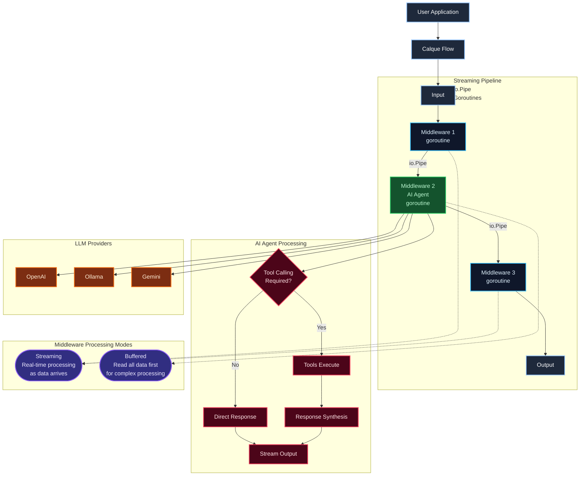

# Go-Calque

<div align="center">
  

  <p>
     <!-- <a href="https://github.com/calque-ai/go-calque/releases"></a> -->
    <a href="https://github.com/calque-ai/go-calque/releases"></a>
    <a href="https://golang.org"></a>
    <a href="https://goreportcard.com/report/github.com/calque-ai/go-calque"></a>
    <a href="https://pkg.go.dev/github.com/calque-ai/go-calque"></a>
    <a href="https://github.com/calque-ai/go-calque/actions/workflows/ci.yml"></a>
    <a href="https://codecov.io/gh/calque-ai/go-calque"></a>
    <a href="https://github.com/calque-ai/go-calque/actions/workflows/ci.yml"></a>
    <a href="https://github.com/calque-ai/go-calque/actions/workflows/ci.yml"></a>
    <a href="https://opensource.org/licenses/MPL-2.0"></a>
    <!-- <a href="https://github.com/calque-ai/go-calque">
      
    </a>
    <a href="https://github.com/calque-ai/go-calque/network/members">
      
    </a> -->
    <a href="https://discord.gg/sga8uzDbth"></a>
  </p>
</div>

A **composable AI agent framework** for Go that makes it easy to build production-ready AI applications.

_Developed by [Calque AI](https://calque.ai)_

## The Problem

Building AI apps in Go means wrestling with:

- **Provider lock-in** - Switching between OpenAI, Gemini, or local models requires rewriting code
- **Conversation state** - Managing chat history and context windows across requests
- **Tool calling** - Connecting AI to your Go functions with proper error handling
- **Structured outputs** - Getting reliable JSON responses that match your types
- **RAG pipelines** - Coordinating document retrieval, embedding, and generation

Go-Calque solves these with a simple, composable middleware pattern that feels native to Go.

## Installation

```bash
go get github.com/calque-ai/go-calque
```

## Quickstart

### Simple AI Chat

```go
package main

import (
    "context"
    "fmt"
    "log"

    "github.com/calque-ai/go-calque/pkg/calque"
    "github.com/calque-ai/go-calque/pkg/middleware/ai"
    "github.com/calque-ai/go-calque/pkg/middleware/ai/ollama"
)

func main() {
    // Initialize AI client
    client, err := ollama.New("llama3.2:3b")
    if err != nil {
        log.Fatal(err)
    }

    // Create flow and run
    flow := calque.NewFlow().Use(ai.Agent(client))

    var result string
    err = flow.Run(context.Background(), "What's the capital of France?", &result)
    if err != nil {
        log.Fatal(err)
    }
    fmt.Println(result)
}
```

That's it. Three lines to set up, one line to run.

## Progressive Complexity

Go-Calque grows with your needs. Start simple, add capabilities as required.

### With Conversation Memory

```go
client, _ := ollama.New("llama3.2:1b")
convMem := memory.NewConversation()

flow := calque.NewFlow().
    Use(convMem.Input("user123")).    // Store user input
    Use(ai.Agent(client)).
    Use(convMem.Output("user123"))    // Store AI response

// First message
flow.Run(ctx, "My name is Alice", &response)

// Second message - AI remembers the conversation
flow.Run(ctx, "What's my name?", &response)
// Response: "Your name is Alice"
```

### With Tool Calling

```go
// Create tools
calculator := tools.Simple("calculator", "Performs math calculations",
    func(jsonArgs string) string {
        var args struct{ Expression string `json:"expression"` }
        json.Unmarshal([]byte(jsonArgs), &args)
        // Calculate and return result
        return evaluate(args.Expression)
    })

weather := tools.Simple("get_weather", "Gets current weather for a city",
    func(jsonArgs string) string {
        var args struct{ City string `json:"city"` }
        json.Unmarshal([]byte(jsonArgs), &args)
        return fetchWeather(args.City)
    })

// Agent automatically calls tools when needed
flow := calque.NewFlow().
    Use(ai.Agent(client, ai.WithTools(calculator, weather)))

flow.Run(ctx, "What's the weather in Tokyo and what's 15% of 340?", &result)
// AI calls both tools and synthesizes the response
```

### With Structured Output

```go
type TaskAnalysis struct {
    TaskType string `json:"task_type" jsonschema:"required,description=Type of task"`
    Priority string `json:"priority" jsonschema:"required,enum=low;medium;high"`
    Hours    int    `json:"hours" jsonschema:"description=Estimated hours"`
}

flow := calque.NewFlow().
    Use(ai.Agent(client, ai.WithSchema(&TaskAnalysis{})))

var analysis TaskAnalysis
flow.Run(ctx, "Build a user authentication system",
    convert.FromJSONSchema[TaskAnalysis](&analysis))

fmt.Printf("Type: %s, Priority: %s, Hours: %d\n",
    analysis.TaskType, analysis.Priority, analysis.Hours)
```

### With RAG (Retrieval-Augmented Generation)

```go
// Initialize vector store (Weaviate, Qdrant, or PGVector)
store := weaviate.New("http://localhost:8080", "Documents")

// Configure retrieval with diversity strategy
strategy := retrieval.StrategyDiverse
searchOpts := &retrieval.SearchOptions{
    Threshold: 0.7,
    Limit:     5,
    Strategy:  &strategy,
    MaxTokens: 2000,
}

// Build RAG pipeline
flow := calque.NewFlow().
    Use(retrieval.VectorSearch(store, searchOpts)).  // Retrieve context
    Use(prompt.Template(`Answer based on this context:
{{.Input}}

Question: {{.Query}}`)).
    Use(ai.Agent(client))

flow.Run(ctx, "How do I configure authentication?", &result)
```

## Why Go-Calque vs. Raw SDKs?

| Challenge               | Raw SDK Approach                                     | Go-Calque Approach                                            |
| ----------------------- | ---------------------------------------------------- | ------------------------------------------------------------- |
| **Provider switching**  | Rewrite API calls, handle different response formats | Change one line: `ollama.New()` → `openai.New()`              |
| **Conversation memory** | Manual state management, serialize/deserialize       | `convMem.Input()` / `convMem.Output()` middleware             |
| **Tool calling**        | Parse responses, match functions, handle errors      | `ai.WithTools(...)` - automatic discovery & execution         |
| **Retries & fallbacks** | Custom retry loops, fallback logic                   | `ctrl.Retry(handler, 3)`, `ctrl.Fallback(primary, backup)`    |
| **Structured output**   | Hope the AI follows instructions, validate manually  | `ai.WithSchema()` - guaranteed valid JSON matching your types |
| **RAG pipelines**       | Coordinate embeddings, search, prompt building       | Chain middleware: `VectorSearch → Template → Agent`           |
| **Testing**             | Mock HTTP clients, parse responses                   | Test each middleware independently                            |

### Code Comparison

**Raw OpenAI SDK:**

```go
// 50+ lines: create client, build messages array, handle streaming,
// parse tool calls, execute functions, rebuild messages, retry on error,
// extract final response, handle rate limits...
```

**Go-Calque:**

```go
flow := calque.NewFlow().
    Use(convMem.Input(userID)).
    Use(ctrl.Retry(ai.Agent(client, ai.WithTools(myTools...)), 3)).
    Use(convMem.Output(userID))

flow.Run(ctx, userMessage, &response)
```

## Real-World Examples

### Chatbot with Memory and Tools

```go
func main() {
    client, _ := openai.New("gpt-4")
    convMem := memory.NewConversation()

    // Define tools
    searchDocs := tools.Simple("search_docs", "Search documentation", searchHandler)
    createTicket := tools.Simple("create_ticket", "Create support ticket", ticketHandler)

    // Build chatbot flow
    chatbot := calque.NewFlow().
        Use(convMem.Input("session")).
        Use(ctrl.Retry(
            ai.Agent(client, ai.WithTools(searchDocs, createTicket)),
            3,
        )).
        Use(convMem.Output("session"))

    // Handle messages
    http.HandleFunc("/chat", func(w http.ResponseWriter, r *http.Request) {
        var req ChatRequest
        json.NewDecoder(r.Body).Decode(&req)

        var response string
        if err := chatbot.Run(r.Context(), req.Message, &response); err != nil {
            http.Error(w, err.Error(), http.StatusInternalServerError)
            return
        }

        json.NewEncoder(w).Encode(ChatResponse{Message: response})
    })
}
```

### RAG Application

```go
func main() {
    client, _ := ollama.New("llama3.2:3b")
    store := qdrant.New("localhost:6334", "knowledge_base")

    // Retrieval configuration
    strategy := retrieval.StrategyRelevant
    searchOpts := &retrieval.SearchOptions{
        Threshold: 0.75,
        Limit:     5,
        Strategy:  &strategy,
        MaxTokens: 3000,
    }

    // RAG pipeline
    ragFlow := calque.NewFlow().
        Use(retrieval.VectorSearch(store, searchOpts)).
        Use(prompt.Template(`You are a helpful assistant. Use the following context to answer questions.

Context:
{{.Input}}

Question: {{.Query}}

Answer based only on the provided context. If the answer isn't in the context, say so.`)).
        Use(ai.Agent(client))

    // API endpoint
    http.HandleFunc("/ask", func(w http.ResponseWriter, r *http.Request) {
        question := r.URL.Query().Get("q")

        var answer string
        if err := ragFlow.Run(r.Context(), question, &answer); err != nil {
            http.Error(w, err.Error(), http.StatusInternalServerError)
            return
        }

        fmt.Fprint(w, answer)
    })
}
```

### Multi-Agent Router

```go
// Create specialized agents
mathAgent := multiagent.Route(
    ai.Agent(mathClient),
    "math",
    "Solve mathematical problems and calculations",
    "calculate,solve,math,equation")

codeAgent := multiagent.Route(
    ai.Agent(codeClient),
    "code",
    "Programming, debugging, code review",
    "code,program,debug,function")

// Router automatically selects best agent
flow := calque.NewFlow().
    Use(multiagent.Router(routerClient, mathAgent, codeAgent))

flow.Run(ctx, "What's the factorial of 10?", &result)  // Routes to mathAgent
flow.Run(ctx, "Write a bubble sort in Go", &result)    // Routes to codeAgent
```

## Middleware Packages

### AI & LLM (`ai/`, `prompt/`)

- **AI Agents**: `ai.Agent(client)` - Connect to OpenAI, Gemini, Ollama, or custom providers
- **Prompt Templates**: `prompt.Template("Question: {{.Input}}")` - Dynamic prompt formatting
- **Structured Output**: `ai.WithSchema(&MyType{})` - Guaranteed JSON matching your types
- **Tool Calling**: `ai.WithTools(tools...)` - Automatic function discovery and execution

### Retrieval & RAG (`retrieval/`)

- **Vector Search**: `retrieval.VectorSearch(store, opts)` - Semantic similarity search with context building
  - Multiple context strategies: Relevant, Recent, Diverse (MMR), Summary
  - Token-limited context assembly with custom separators
  - Adaptive similarity algorithms (Cosine, Jaccard, Jaro-Winkler, Hybrid)
- **Document Loading**: `retrieval.DocumentLoader(sources...)` - Load documents from files and URLs
  - Glob pattern support for file paths
  - Concurrent loading with worker pools
  - Automatic metadata extraction
- **Vector Store Interface**: Provider-agnostic interface for multiple backends
  - Weaviate, Qdrant, and PGVector client implementations
  - Auto-embedding and external embedding provider support
  - Native diversification (MMR) and reranking capabilities

### Memory & State (`memory/`)

- **Conversation Memory**: Track chat history with configurable limits
- **Context Windows**: Sliding window memory management for long conversations
- **Storage Backends**: In-memory, Badger, or add a custom storage adapter

### Flow Control (`ctrl/`)

- **Timeouts**: `ctrl.Timeout(handler, duration)` - Prevent hanging operations
- **Retries**: `ctrl.Retry(handler, attempts)` - Handle transient failures
- **Fallbacks**: `ctrl.Fallback(primary, backup)` - Graceful degradation
- **Parallel Processing**: `ctrl.Parallel(handlers...)` - Concurrent execution
- **Chain Composition**: `ctrl.Chain(handlers...)` - Sequential middleware chains

### Tool Integration (`tools/`)

- **Function Calling**: Execute Go functions from AI agents
- **Tool Registry**: Manage and discover available functions
- **Concurrent Execution**: Run multiple tools in parallel
- **Error Handling**: Configurable behavior when tools fail

### Multi-Agent (`multiagent/`)

- **Agent Routing**: Route requests to specialized agents based on content
- **Load Balancing**: Distribute load across multiple agent instances

### Model Context Protocol (`mcp/`)

- **MCP Client**: Connect to MCP servers to access tools, resources, and prompts
- **Multiple Transports**: Stdio, SSE, and StreamableHTTP support
- **Native LLM Tool Calling**: MCP tools converted to native LLM format for better accuracy
- **Natural Language Usage**: AI-powered tool discovery and execution
  - `mcp.RegisterTools(client)` - Register available MCP tools
  - `mcp.DetectTools(client, llmClient)` - AI-powered tool selection
  - `mcp.ExtractToolParams(client, llmClient)` - Extract parameters from user input
  - `mcp.ExecuteTools(client)` - Execute detected tools

### Caching (`cache/`)

- **Response Caching**: `cache.Cache(handler, ttl)` - Cache handler responses with TTL
- **Pluggable Backends**: In-memory store or custom storage adapters

### Observability (`logger/`)

- **Logging**: `logger.Print(label)` - Log the whole input with a prefix label
- **Head Logging**: `logger.Head(label, bytes)` - Log first N bytes for streaming
- **Chunk Logging**: `logger.Chunks(label, size)` - Log streaming data in chunks

## Converters

Transform structured data at flow boundaries:

**Input Converters** (prepare data for processing):

```go
convert.ToJSON(struct)         // Struct → JSON stream
convert.ToYAML(struct)         // Struct → YAML stream
convert.ToJSONSchema(struct)   // Struct + schema → stream (for AI context)
convert.ToProtobuf(msg)        // Proto message → binary stream
convert.ToSSE(data)            // Data → Server-Sent Events stream
```

**Output Converters** (parse results):

```go
convert.FromJSON(&result)           // JSON stream → struct
convert.FromYAML(&result)           // YAML stream → struct
convert.FromJSONSchema(&result)     // JSON stream → struct (validates against schema)
convert.FromProtobuf(&result)       // Binary stream → proto message
```

## Architecture Deep Dive

Go-Calque brings **HTTP middleware patterns** to AI and data processing. Instead of handling HTTP requests, you compose flows where each middleware processes data through `io.Pipe` connections.

### Streaming Architecture



### Key Architecture Patterns

🔄 **Streaming Pipeline**: `Input → Middleware1 → Middleware2 → Middleware3 → Output` connected by **io.Pipe** with each middleware running in its own **goroutine**

⚡ **Concurrent Execution**: Each middleware runs in its own goroutine with automatic backpressure handling

📊 **Middleware Processing Modes**:

- **Streaming**: Real-time processing as data arrives (no buffering)
- **Buffered**: Reads all data first for complex processing when needed

🔗 **Context Propagation**: Cancellation and timeouts flow through the entire chain

### Why Streaming Matters

- **Memory Efficient**: Constant memory usage regardless of input size
- **Real-time Processing**: Responses begin immediately, no waiting for full datasets
- **True Concurrency**: Each middleware runs in its own goroutine
- **Go-Idiomatic**: Built with Go conventions using `io.Reader`/`io.Writer`

### Writing Custom Middleware

Create your own middleware by implementing `calque.HandlerFunc`:

```go
// Custom middleware that adds timestamps (BUFFERED - reads all input first)
func AddTimestamp(prefix string) calque.HandlerFunc {
    return func(req *calque.Request, res *calque.Response) error {
        // Read input using the Read helper
        var input string
        if err := calque.Read(req, &input); err != nil {
            return err
        }

        // Transform data
        timestamp := time.Now().Format("2006-01-02 15:04:05")
        output := fmt.Sprintf("[%s %s] %s", prefix, timestamp, input)

        // Write output using the Write helper
        return calque.Write(res, output)
    }
}

// Usage
flow := calque.NewFlow().
    Use(AddTimestamp("LOG")).
    Use(text.Transform(strings.ToUpper))
```

### Streaming Middleware

For processing large data streams without buffering:

```go
func StreamingProcessor() calque.HandlerFunc {
    return func(req *calque.Request, res *calque.Response) error {
        // Process data line by line
        scanner := bufio.NewScanner(req.Data)
        for scanner.Scan() {
            line := scanner.Text()
            processed := fmt.Sprintf("PROCESSED: %s\n", line)
            if _, err := res.Data.Write([]byte(processed)); err != nil {
                return err
            }
        }
        return scanner.Err()
    }
}
```

### Concurrency Control

```go
// For high-traffic scenarios, limit goroutine creation
config := calque.FlowConfig{
    MaxConcurrent: calque.ConcurrencyAuto, // Auto-scales with CPU cores
    CPUMultiplier: 10,                     // 10x GOMAXPROCS
}

flow := calque.NewFlow(config).
    Use(ai.Agent(client))
```

## Advanced Topics

### Error Handling & Retries

```go
flow := calque.NewFlow().
    Use(ctrl.Retry(ai.Agent(client), 3)).
    Use(ctrl.Fallback(
        ai.Agent(primaryClient),
        ai.Agent(backupClient),
    ))
```

### Flow Composition

```go
// Build reusable sub-flows
textPreprocessor := calque.NewFlow().
    Use(text.Transform(strings.TrimSpace)).
    Use(text.Transform(strings.ToLower))

textAnalyzer := calque.NewFlow().
    Use(text.Transform(func(s string) string {
        wordCount := len(strings.Fields(s))
        return fmt.Sprintf("TEXT: %s\nWORDS: %d", s, wordCount)
    }))

// Compose sub-flows into main flow
mainFlow := calque.NewFlow().
    Use(textPreprocessor).
    Use(text.Branch(
        func(s string) bool { return len(s) > 50 },
        textAnalyzer,
        text.Transform(func(s string) string { return s + " [SHORT]" }),
    ))
```

### HTTP API Integration

```go
// Expose your flow as an HTTP endpoint
http.HandleFunc("/chat", func(w http.ResponseWriter, r *http.Request) {
    var req ChatRequest
    json.NewDecoder(r.Body).Decode(&req)

    var response string
    flow.Run(r.Context(), req.Message, &response)

    json.NewEncoder(w).Encode(ChatResponse{Message: response})
})
```

### SSE Streaming

```go
http.HandleFunc("/stream", func(w http.ResponseWriter, r *http.Request) {
    w.Header().Set("Content-Type", "text/event-stream")

    sseConverter := convert.ToSSE(w, userID).
        WithChunkMode(convert.SSEChunkByWord)

    flow.Run(r.Context(), message, sseConverter)
})
```

## Performance

Go-Calque's optimized middleware composition delivers both performance and memory efficiency. Benchmarks from our [anagram processing example](examples/anagram/) show:

### Benchmark Results vs Hand-Coded Algorithm

| Configuration                            | Dataset            | Algorithm | Time (ns/op) | Memory (B/op) | Allocations | Time Improvement | Memory Improvement |
| ---------------------------------------- | ------------------ | --------- | ------------ | ------------- | ----------- | ---------------- | ------------------ |
| **VirtualApple @ 2.50GHz, darwin/amd64** | Small (29 words)   | Baseline  | 69,377       | 76,736        | 685         | -                | -                  |
|                                          |                    | Go-Calque | 51,964       | 32,343        | 479         | **25% faster**   | **58% less**       |
|                                          | Large (1000 words) | Baseline  | 4,232,972    | 4,011,708     | 33,990      | -                | -                  |
|                                          |                    | Go-Calque | 523,240      | 469,156       | 9,574       | **88% faster**   | **88% less**       |
| **linux/amd64 x86_64**                   | Small (29 words)   | Baseline  | 51,617       | 76,736        | 685         | -                | -                  |
|                                          |                    | Go-Calque | 59,473       | 32,361        | 430         | 15% slower       | **58% less**       |
|                                          | Large (1000 words) | Baseline  | 3,105,624    | 4,011,673     | 33,990      | -                | -                  |
|                                          |                    | Go-Calque | 537,898      | 469,359       | 5,489       | **83% faster**   | **88% less**       |

**Performance Principle**: Well-designed middleware composition outperforms hand-coded algorithms while remaining maintainable and composable.

_Run the benchmarks: `cd examples/anagram && go test -bench=.`_

## Roadmap

### Priority Middleware

**Tool Calling** - ✅ Function execution for AI agents
**Information Retrieval** - ✅ Vector search, ✅ context building, ✅ semantic filtering
**Multi-Agent Collaboration** - 🔲 Agent selection, ✅ load balancing, ✅ conditional routing
**Guardrails & Safety** - 🔲 Input filtering, 🔲 output validation, ✅ schema compliance
**HTTP/API Integration** - ✅ streaming responses
**Model Context Protocol** - ✅ MCP client, ✅ natural language tools, ✅ StreamableHTTP

### Framework Improvements

**Enhanced Memory** - 🔲 Vector-based semantic memory retrieval
**Advanced Agents** - 🔲 Planning, 🔲 reflection, 🔲 self-evaluation capabilities
**Additional Providers** - 🔲 Anthropic/Claude support

### Essential Examples

**Core Framework**: ✅ basics, ✅ converters, ✅ converters-jsonschema, ✅ streaming-chats
**Data Processing**: ✅ memory, ✅ batch-processing, ✅ flow-composition
**AI Agents**: ✅ tool-calling, ✅ retrieval, 🔲 multi-agent-workflow, 🔲 guardrails-validation
**Advanced**: ✅ web-api-agent, 🔲 human-in-the-loop

### Nice-to-Have

**Batch Processing** - 🔲 Splitters, 🔲 aggregators, ✅ parallel processors
**State Management** - 🔲 State machines, 🔲 checkpoints, ✅ conditional flows
**Agent2Agent Protocol** - 🔲 A2A server, 🔲 examples

## Contributing

1. Fork the repository
2. Create a feature branch
3. Add tests for new middleware
4. Submit a pull request

## Contributors

Thanks to all contributors who are helping to make Go-Calque better.

<a href="https://github.com/calque-ai/go-calque/graphs/contributors">
  
</a>

## Star History

<a href="https://www.star-history.com/#calque-ai/go-calque&Date">
 <picture>
   <source media="(prefers-color-scheme: dark)" srcset="https://api.star-history.com/svg?repos=calque-ai/go-calque&type=Date&theme=dark" />
   <source media="(prefers-color-scheme: light)" srcset="https://api.star-history.com/svg?repos=calque-ai/go-calque&type=Date" />
   
 </picture>
</a>

## License

Mozilla Public License 2.0 - see [LICENSE](LICENSE) file for details.
