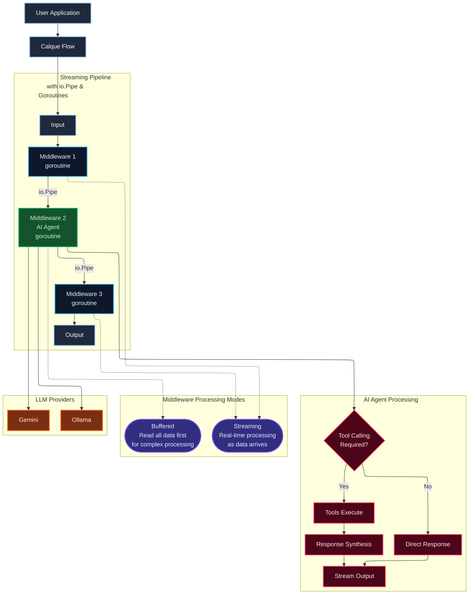

# Go-Calque


An idiomatic streaming **multi-agent AI framework** for Go.

_Developed by [Calque AI](https://calque.ai)_

## Installation

```bash
go get github.com/calque-ai/go-calque
```

## Quickstart

```go
package main

import (
    "context"
    "log"
    "time"

    "github.com/calque-ai/go-calque/pkg/calque"
    "github.com/calque-ai/go-calque/pkg/middleware/ai"
    "github.com/calque-ai/go-calque/pkg/middleware/ai/ollama"
)

func main() {
    // Initialize AI client
    client, err := ollama.New("llama3.2:3b")
    if err != nil {
        log.Fatal(err)
    }

    // Create AI flow
    flow := calque.NewFlow().
        Use(ai.Agent(client)).

    var result string
    err = flow.Run(context.Background(), "What's the capital of France?", &result)
    if err != nil {
        log.Fatal(err)
    }
}
```

## Features

✅ **Streaming First** - Process data as it flows, not after it's fully loaded  
✅ **True Concurrency** - Each middleware runs in its own goroutine  
✅ **Memory Efficient** - Constant memory usage regardless of input size  
✅ **Real-time Processing** - Responses begin immediately, no waiting for full datasets  
✅ **Composable** - Chain middleware just like HTTP handlers  
✅ **AI-Native** - Built-in support for LLMs and AI workflows  
✅ **Go-Idiomatic** - Built with Go conventions using `io.Reader`/`io.Writer`, not porting Python patterns

## Philosophy

Go-Calque brings **HTTP middleware patterns** to AI and data processing. Instead of handling HTTP requests, you compose flows where each middleware processes streaming data through `io.Pipe` connections.

**The Pattern**: Chain middleware like HTTP handlers, but for streaming data:

```go
flow := calque.NewFlow().
    Use(middleware1).
    Use(middleware2).
    Use(middleware3)

err := flow.Run(ctx, input, &output)
```

## Architecture Overview



**Key Architecture Patterns:**

🔄 **Streaming Pipeline**: `Input → Middleware1 → Middleware2 → Middleware3 → Output` connected by **io.Pipe** with each middleware running in its own **goroutine**

⚡ **Concurrent Execution**: Each middleware runs in its own goroutine with automatic backpressure handling

📊 **Middleware Processing Modes**: 
- **Streaming**: Real-time processing as data arrives (no buffering)
- **Buffered**: Reads all data first for complex processing when needed

🔗 **Context Propagation**: Cancellation and timeouts flow through the entire chain

🤖 **AI Agent Processing**: Intelligent decision-making for tool calling vs direct chat, with response synthesis

🌐 **LLM Provider Layer**: 
- **Ollama** 🏠 Local server (privacy, no API costs)
- **Gemini** ☁️ Google Cloud API (advanced capabilities)

🧩 **Available Middleware**: Memory (Context/Conversation), Prompt Templates, Ctrl (Chain/Batch/Fallback), Tools (Registry/Detect/Execute), Cache, MultiAgent (Routing/Consensus)

## Middleware Packages

Go-Calque includes middleware for common AI and data processing patterns:

### AI & LLM (`ai/`, `prompt/`)

- **AI Agents**: `ai.Agent(client)` - Connect to Gemini, Ollama, or custom providers
- **Prompt Templates**: `prompt.Template("Question: {{.Input}}")` - Dynamic prompt formatting
- **Streaming Support**: Real-time response processing as tokens arrive

### Flow Control (`ctrl/`)

- **Timeouts**: `ctrl.Timeout(handler, duration)` - Prevent hanging operations
- **Retries**: `ctrl.Retry(handler, attempts)` - Handle transient failures
- **Parallel Processing**: `ctrl.Parallel(handlers...)` - Concurrent execution
- **Chain Composition**: `ctrl.Chain(handlers...)` - Sequential middleware chains
- **Conditional Logic**: `ctrl.Branch(condition, ifTrue, ifFalse)` - Dynamic routing

### Data Processing (`text/`)

- **Text Transform**: `text.Transform(func)` - Simple string transformations
- **Line Processing**: `text.LineProcessor(func)` - Process large files line-by-line
- **Text Branching**: `text.Branch(condition, ifTrue, ifFalse)` - Conditional text processing

### Memory & State (`memory/`)

- **Conversation Memory**: Track chat history with configurable limits
- **Context Windows**: Sliding window memory management for long conversations
- **Storage Backends**: In-memory, Badger, or add a custom storage adapter

### Observability (`logger/`)

- **Logging**: `logger.Print(label)` - Log the whole input with a prefix label
- **Head Logging**: `logger.Head(label, bytes)` - Log first N bytes for streaming
- **Chunk Logging**: `logger.Chunks(label, size)` - Log streaming data in chunks

### Tool Integration (`tools/`)

- **Function Calling**: Execute Go functions from AI agents
- **Tool Registry**: Manage and discover available functions
- **Automatic Detection**: Parse AI responses for function calls

### Multi-Agent (`multiagent/`)

- **Agent Routing**: Route requests to different agents based on content
- **Load Balancing**: Distribute load across multiple agent instances

## Converters

Transform structured data at flow boundaries:

**Input Converters** (prepare data for processing):

```go
convert.ToJson(struct)      // Struct → JSON stream
convert.ToYaml(struct)      // Struct → YAML stream
convert.ToJsonSchema(struct) // Struct + schema → stream (for AI context)
```

**Output Converters** (parse results):

```go
convert.FromJson(&result)           // JSON stream → struct
convert.FromYaml(&result)           // Yaml stream → struct
convert.FromJsonSchema(&result)     // Validates output against schema
```

**Usage:**

```go
// JSON processing flow
err := flow.Run(ctx, convert.ToJson(data), convert.FromJson(&result))

// input and output json with schema validation. Useful for AI structured output
err := flow.Run(ctx, convert.ToJsonSchema(input), convert.FromJsonSchema[Output](&result))
```

## Examples

### Basic Text Processing

```go
flow := calque.NewFlow().
    Use(text.Transform(strings.ToUpper)).
    Use(text.Transform(func(s string) string {
        return fmt.Sprintf("Processed: %s", s)
    }))

var result string
flow.Run(ctx, "hello", &result)
// Result: "Processed: HELLO"
```

### AI Chat with Memory

```go
client, _ := ollama.New("llama3.2:1b")
convMem := memory.NewConversation()

flow := calque.NewFlow().
    Use(convMem.Input("user123")). //store input
    Use(prompt.Template("User: {{.Input}}\nAssistant:")).
    Use(ai.Agent(client)).
    Use(convMem.Output("user123")) //store ai response

var response string
flow.Run(ctx, "What's the capital of France?", &response)
```

### JSON Schema Validation

```go
type TaskAnalysis struct {
    TaskType string `json:"task_type" jsonschema:"required,description=Type of development task"`
    Priority string `json:"priority" jsonschema:"required,description=Task priority level"`
    Hours    int    `json:"hours" jsonschema:"description=Estimated hours to complete"`
}

flow := calque.NewFlow().
    Use(ai.Agent(client, ai.WithSchema(&TaskAnalysis{})))

var analysis TaskAnalysis
flow.Run(ctx, "Build a chat app", convert.FromJsonSchema[TaskAnalysis](&analysis))
```

### Flow Composition

```go
// Build reusable sub-flows
textPreprocessor := calque.NewFlow().
    Use(text.Transform(strings.TrimSpace)).
    Use(text.Transform(strings.ToLower))

textAnalyzer := calque.NewFlow().
    Use(text.Transform(func(s string) string {
        wordCount := len(strings.Fields(s))
        return fmt.Sprintf("TEXT: %s\nWORDS: %d", s, wordCount)
    }))

// Compose sub-flows into main flow
mainFlow := calque.NewFlow().
    Use(logger.Print("INPUT")).
    Use(textPreprocessor).              // Use preprocessing sub-flow
    Use(text.Branch(                    // Branch based on content length
        func(s string) bool { return len(s) > 50 },
        textAnalyzer,                   // Long text: use analysis sub-flow
        text.Transform(func(s string) string {
            return s + " [SHORT TEXT]"
        }), // Short text: simple processing
    )).
    Use(logger.Print("OUTPUT"))

var result string
mainFlow.Run(ctx, "  Hello WORLD!  This is a Test  ", &result)
```

## Writing Custom Middleware

Create your own middleware by implementing `calque.HandlerFunc`:

```go
package main

import (
    "fmt"
    "strings"
    "time"

    "github.com/calque-ai/go-calque/pkg/calque"
)

// Custom middleware that adds timestamps (BUFFERED - reads all input first)
func AddTimestamp(prefix string) calque.HandlerFunc {
    return func(req *calque.Request, res *calque.Response) error {
        // Read input using the Read helper
        var input string
        if err := calque.Read(req, &input); err != nil {
            return err
        }

        // Transform data
        timestamp := time.Now().Format("2006-01-02 15:04:05")
        output := fmt.Sprintf("[%s %s] %s", prefix, timestamp, input)

        // Write output using the Write helper
        return calque.Write(res, output)
    }
}

// Usage
func main() {
    flow := calque.NewFlow().
        Use(AddTimestamp("LOG")).
        Use(text.Transform(strings.ToUpper))

    var result string
    flow.Run(ctx, "hello world", &result)
    // Result: "[LOG 2024-01-15 14:30:45] HELLO WORLD"
}
```

### Streaming Middleware

For processing large data streams without buffering:

```go
func StreamingProcessor() calque.HandlerFunc {
    return func(req *calque.Request, res *calque.Response) error {
        // Process data line by line
        scanner := bufio.NewScanner(req.Data)
        for scanner.Scan() {
            line := scanner.Text()
            processed := fmt.Sprintf("PROCESSED: %s\n", line)
            if _, err := res.Data.Write([]byte(processed)); err != nil {
                return err
            }
        }
        return scanner.Err()
    }
}
```

## Advanced Topics

### Concurrency Control

```go
// For high-traffic scenarios, limit goroutine creation
config := calque.FlowConfig{
    MaxConcurrent: calque.ConcurrencyAuto, // Auto-scales with CPU cores
    CPUMultiplier: 10,                     // 10x GOMAXPROCS
}

flow := calque.NewFlow(config).
    Use(ai.Agent(client)).
    Use(logger.Print("RESPONSE"))
```

### Error Handling & Retries

```go
flow := calque.NewFlow().
    Use(ctrl.Retry(ai.Agent(client), 3)).
    Use(ctrl.Fallback(
        ai.Agent(primaryClient),
        ai.Agent(backupClient),
    ))
```

### Multi-Agent Routing

```go
// Create routed handlers with metadata
mathHandler := multiagent.Route(
    ai.Agent(mathClient),
    "math",
    "Solve mathematical problems, calculations, equations",
    "calculate,solve,math,equation")

codeHandler := multiagent.Route(
    ai.Agent(codeClient),
    "code",
    "Programming, debugging, code review",
    "code,program,debug,function")

// selectionClient automatically selects best handler based on flow input
flow := calque.NewFlow().
    Use(multiagent.Router(selectionClient, mathHandler, codeHandler))
```

### Tool Calling

```go
// Create tools
calculator := tools.Simple("calculator", "Performs basic math calculations", func(expression string) string {
    // tool implementation
    return "42"
})

currentTime := tools.Simple("current_time", "Gets current date and time", func(format string) string {
    return time.Now().Format("2006-01-02 15:04:05")
})

// Agent with tools
flow := calque.NewFlow().
    Use(ai.Agent(client, ai.WithTools(calculator, currentTime)))
```

## Performance

Go-Calque's optimized middleware composition delivers both performance and memory efficiency. Benchmarks from our [anagram processing example](examples/anagram/) show:

### Benchmark Results vs Hand-Coded Algorithm

| Configuration | Dataset | Algorithm | Time (ns/op) | Memory (B/op) | Allocations | Time Improvement | Memory Improvement |
|---------------|---------|-----------|--------------|---------------|-------------|------------------|--------------------|
| **VirtualApple @ 2.50GHz, darwin/amd64** | Small (29 words) | Baseline | 69,377 | 76,736 | 685 | - | - |
| | | Go-Calque | 51,964 | 32,343 | 479 | **25% faster** | **58% less** |
| | Large (1000 words) | Baseline | 4,232,972 | 4,011,708 | 33,990 | - | - |
| | | Go-Calque | 523,240 | 469,156 | 9,574 | **88% faster** | **88% less** |
| **linux/amd64 x86_64** | Small (29 words) | Baseline | 51,617 | 76,736 | 685 | - | - |
| | | Go-Calque | 59,473 | 32,361 | 430 | 15% slower | **58% less** |
| | Large (1000 words) | Baseline | 3,105,624 | 4,011,673 | 33,990 | - | - |
| | | Go-Calque | 537,898 | 469,359 | 5,489 | **83% faster** | **88% less** |

**Performance Principle**: Well-designed middleware composition outperforms hand-coded algorithms while remaining maintainable and composable.

_Run the benchmarks: `cd examples/anagram && go test -bench=.`_

## Roadmap

### Priority Middleware

**Tool Calling** - ✅ Function execution for AI agents
**Information Retrieval** - Vector search, context building, semantic filtering
**Multi-Agent Collaboration** - Agent selection, ✅ load balancing, ✅ conditional routing  
**Guardrails & Safety** - Input filtering, output validation, ✅ schema compliance  
**HTTP/API Integration** - ✅ streaming responses

### Framework Improvements

**Enhanced Memory** - Vector-based semantic memory retrieval  
**Advanced Agents** - Planning, reflection, and self-evaluation capabilities

### Essential Examples

**Core Framework**: ✅ basics, ✅ converters, ✅ converters-jsonschema, ✅ streaming-chats  
**Data Processing**: ✅ memory, ✅ batch-processing, ✅ flow-composition  
**AI Agents**: ✅ tool-calling, 🔲 rag, 🔲 multi-agent-workflow, 🔲 guardrails-validation  
**Advanced**: ✅ web-api-agent, 🔲 human-in-the-loop

### Nice-to-Have

**Batch Processing** - Splitters, aggregators, ✅ parallel processors  
**State Management** - State machines, checkpoints, ✅ conditional flows

## Contributing

1. Fork the repository
2. Create a feature branch
3. Add tests for new middleware
4. Submit a pull request

## License

Mozilla Public License 2.0 - see [LICENSE](LICENSE) file for details.
