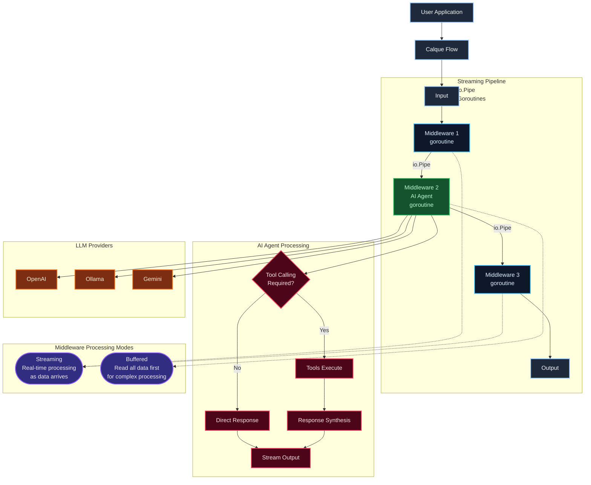

# Architecture

Deep dive into Go-Calque's streaming pipeline architecture.

## Overview

Go-Calque brings **HTTP middleware patterns** to AI and data processing. Instead of handling HTTP requests, you compose flows where each middleware processes data through `io.Pipe` connections.

```
Input → Middleware1 → Middleware2 → Middleware3 → Output
         goroutine     goroutine     goroutine
            ↓             ↓             ↓
         io.Pipe       io.Pipe       io.Pipe
```

## Streaming Pipeline



## Key Concepts

### The Handler Interface

Every middleware implements the `Handler` interface:

```go
type Handler interface {
    ServeFlow(*Request, *Response) error
}

// Function adapter for convenience
type HandlerFunc func(req *Request, res *Response) error
```

The `Request` contains:
- `Data` - `io.Reader` with input data
- `Context` - Go context for cancellation

The `Response` contains:
- `Data` - `io.Writer` for output data

### Processing Modes

Middleware can process data in two ways:

#### Streaming Mode

Process data as it arrives without buffering:

```go
func StreamingHandler() calque.HandlerFunc {
    return func(req *calque.Request, res *calque.Response) error {
        scanner := bufio.NewScanner(req.Data)
        for scanner.Scan() {
            line := scanner.Text()
            processed := fmt.Sprintf("PROCESSED: %s\n", line)
            if _, err := res.Data.Write([]byte(processed)); err != nil {
                return err
            }
        }
        return scanner.Err()
    }
}
```

**Benefits:**
- Constant memory usage
- Real-time output
- No waiting for full input

#### Buffered Mode

Read all input first, then process:

```go
func BufferedHandler() calque.HandlerFunc {
    return func(req *calque.Request, res *calque.Response) error {
        var input string
        if err := calque.Read(req, &input); err != nil {
            return err
        }
        
        // Process complete input
        output := transform(input)
        
        return calque.Write(res, output)
    }
}
```

**When to use:**
- AI calls (need full prompt)
- Complex transformations
- Aggregations

### Concurrent Execution

Each middleware runs in its own goroutine:

```go
// Simplified internal execution
for _, handler := range handlers {
    go func(h Handler) {
        h.ServeFlow(req, res)
    }(handler)
}
```

Data flows through `io.Pipe` connections which provide automatic backpressure.

### Context Propagation

Cancellation and timeouts flow through the entire chain:

```go
ctx, cancel := context.WithTimeout(context.Background(), 30*time.Second)
defer cancel()

flow.Run(ctx, input, &output)
// All handlers receive the same context
```

## Flow Configuration

### Concurrency Control

```go
config := calque.FlowConfig{
    MaxConcurrent: calque.ConcurrencyAuto,  // Scale with CPU cores
    CPUMultiplier: 10,                       // 10x GOMAXPROCS
}

flow := calque.NewFlow(config)
```

Options:
- `ConcurrencyUnlimited` - No limit (default)
- `ConcurrencyAuto` - Based on CPU cores
- Positive integer - Fixed limit

### MetadataBus

Thread-safe metadata sharing between concurrent middleware:

```go
// In one handler
req.MetadataBus.Set("user_id", "123")

// In another handler (concurrent)
userID := req.MetadataBus.Get("user_id")
```

## Chain vs Flow

### Regular Flow

```go
flow := calque.NewFlow().
    Use(handler1).
    Use(handler2).
    Use(handler3)
```

- Each handler runs in its own goroutine
- Connected by `io.Pipe`
- True concurrent execution
- Best for: parallel operations, streaming

### ctrl.Chain

```go
ctrl.Chain(handler1, handler2, handler3)
```

- Sequential execution
- Buffered data between handlers
- Full context propagation
- Best for: tool calling, context-dependent operations

### When to Use What

| Use Case | Recommendation |
|----------|----------------|
| AI chat with streaming output | Regular flow |
| Tool calling / context propagation | `ctrl.Chain` |
| Parallel tool execution | Regular flow |
| Simple transformations | `ctrl.Chain` |
| High-throughput HTTP API | Regular flow |

## Input/Output Converters

Converters transform structured data at flow boundaries:

```go
flow := calque.NewFlow().
    Use(handler1).
    Use(handler2)

// Input conversion: struct → stream
// Output conversion: stream → struct
flow.Run(ctx, 
    convert.ToJSON(inputStruct),
    convert.FromJSON(&outputStruct),
)
```

The framework automatically handles conversion between your types and the streaming interface.

## Error Handling

Errors propagate through the pipeline:

```go
func Handler() calque.HandlerFunc {
    return func(req *calque.Request, res *calque.Response) error {
        // Errors are returned up the chain
        if err := doSomething(); err != nil {
            return calque.WrapErr(req.Context, err, "handler failed")
        }
        return nil
    }
}
```

Context-aware errors automatically include trace and request IDs.

## Performance Characteristics

| Aspect | Behavior |
|--------|----------|
| Memory | O(1) for streaming, O(n) for buffered |
| Latency | First byte immediately for streaming |
| Concurrency | Automatic with goroutines |
| Backpressure | Automatic via `io.Pipe` |

See [Benchmark Analysis](BENCHMARK_ANALYSIS_REPORT.md) for detailed metrics.

---

## Next

**→ [Advanced Topics](advanced.md)** - Custom middleware, testing, and optimization patterns

